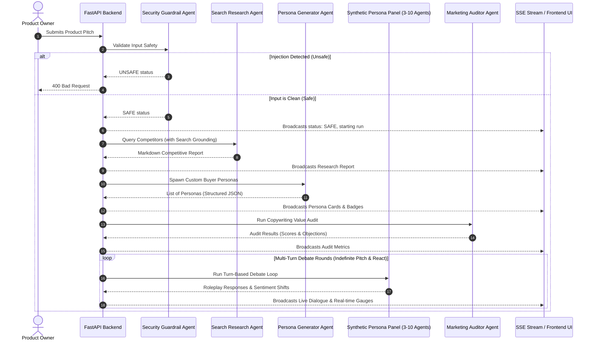

# Synthetica — The Agentic Market Sandbox

Synthetica is an automated, multi-agent focus group simulator designed to validate startup ideas, marketing copy, and pricing models instantly. By leveraging real-time search-grounded market audits, structured buyer persona generators, and multi-agent debate pipelines, Synthetica acts as a full-fledged validation sandbox for founders and product teams.

This project was built as a capstone project for the **Google AI Agents: Intensive Vibe Coding Course** on Kaggle, demonstrating state-of-the-art agent architectures, Model Context Protocol (MCP), and production-grade security guardrails.

---

## 🚀 Key Features & Rubric Highlights
Synthetica demonstrates 5 out of the 6 core course concepts inside a unified codebase:

1. **Multi-Agent Orchestration (ADK Concept):** Coordinates a cooperative team of specialized agents—researchers, persona generators, and custom roleplay focus group panelists—using asynchronous, multi-turn state management.
2. **Model Context Protocol (MCP Server):** Exposes market analysis and copywriting audits as native tools using an integrated stdio MCP server (`mcp_server.py`), allowing external hosts (like Cursor or Claude Desktop) to invoke them.
3. **Agentic Security Guardrail:** Prevents prompt injections, system hijacking, or inappropriate inputs by running user entries through a defensive security middleware agent before processing.
4. **Grounded Tool Usage:** Integrates Google Search Grounding to fetch live, factual competitor lists, pricing structures, and user reviews from the web.
5. **Unified Google Cloud & Vertex AI Deployability:** Equipped with a `Dockerfile` for Cloud Run, utilizing Application Default Credentials (ADC) to authenticate with Vertex AI without hardcoded keys.

---

## 📐 System Architecture

The following diagram illustrates the data flow and multi-agent coordination during a validation simulation:



---

## 📂 Project Directory Structure

```text
d:\kaggle\
├── requirements.txt      # Python dependencies (FastAPI, Uvicorn, google-genai, mcp)
├── config.py             # Client config supporting Google AI Studio (API key) and Vertex AI (ADC)
├── agents.py             # Definition of agent schemas (Pydantic) and Agent Classes (Guardrail, Researcher)
├── simulation.py         # Orchestrates the debate state engine and Event Queue
├── main.py               # FastAPI server endpoints and static file serving
├── mcp_server.py         # Model Context Protocol stdio server
├── Dockerfile            # Container configuration for Cloud Run deployment
└── static/               # Frontend Single Page Application (SPA)
    ├── index.html        # Glassmorphic sci-fi dashboard shell
    ├── style.css         # Styling rules, progress meters, gauges, animations
    └── app.js            # Particle background canvas, SSE stream handling, reactive state
```

---

## 🛠️ Local Installation & Setup

### Prerequisites
* Python 3.10+
* Google AI Studio API Key (or a Google Cloud project with Vertex AI access)

### 1. Clone the Repository & Install Dependencies
```bash
pip install -r requirements.txt
```

### 2. Configure Environment Variables
Create a `.env` file in the root folder:
```env
# 1. For Local Development (Google AI Studio Key)
GEMINI_API_KEY=AIzaSy...

# 2. For Vertex AI (Optional / Cloud Run Deployment)
VERTEX_PROJECT=your-gcp-project-id
VERTEX_LOCATION=us-central1
```

### 3. Launch the Web Application
```bash
python main.py
```
Open your browser and navigate to **[http://localhost:8000](http://localhost:8000)**.

---

## 🔌 Connecting via Model Context Protocol (MCP)

To expose Synthetica's tools to your own IDE or AI client:

1. Run the MCP server over standard input/output:
   ```bash
   python mcp_server.py
   ```
2. Configure your MCP Client (e.g., Claude Desktop config at `%APPDATA%\Claude\claude_desktop_config.json`):
   ```json
   {
     "mcpServers": {
       "synthetica-sandbox": {
         "command": "python",
         "args": ["d:/kaggle/mcp_server.py"],
         "env": {
           "GEMINI_API_KEY": "your_api_key_here"
         }
       }
     }
   }
   ```

Exposed MCP Tools:
* `research_market(idea, industry)`: Conducts a search-grounded competitive research audit.
* `audit_pitch(idea, industry)`: Audits the copy effectiveness and lists objections.

---

## ☁️ Google Cloud Run Deployment

To containerize and deploy Synthetica to Google Cloud Run:

1. **Submit Build to Google Container Registry:**
   ```bash
   gcloud builds submit --tag gcr.io/YOUR_PROJECT_ID/synthetica
   ```
2. **Deploy Container:**
   ```bash
   gcloud run deploy synthetica \
       --image gcr.io/YOUR_PROJECT_ID/synthetica \
       --platform managed \
       --region us-central1 \
       --allow-unauthenticated \
       --set-env-vars GOOGLE_GENAI_USE_VERTEXAI=true,VERTEX_PROJECT=YOUR_PROJECT_ID,VERTEX_LOCATION=us-central1
   ```
*(Note: Cloud Run will automatically authenticate using the attached service account credentials, bypassing the need for a hardcoded API key).*

---

## 🛡️ Agentic Security Implementation
To prevent jailbreaking, prompt injections, or instructions hijacking during the interactive user pitch phase, all user inputs are routed through the `SecurityGuardrail` agent before hitting the simulation panel. 

The guardrail uses a strict evaluation prompt:
* It analyzes the text for system override phrases (e.g., *"ignore previous instructions"*).
* It blocks requests attempting to bypass content filters.
* If a violation is flagged, it stops processing, returns a `400 Bad Request`, and displays a red safety toast on the user interface.
